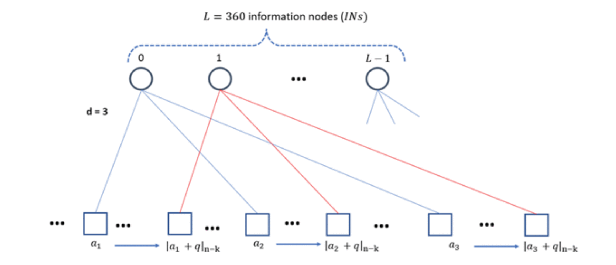
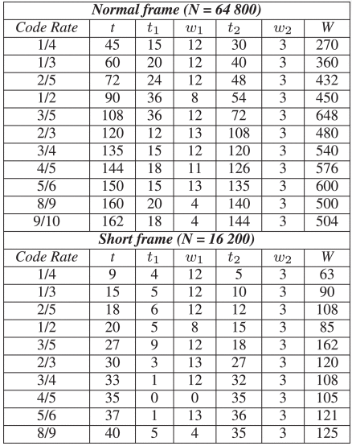
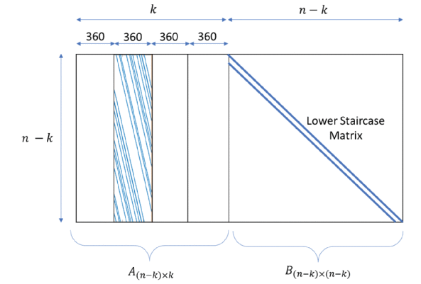

#### I. DVB-S2 Encoding Algorithm

---

码字：
$$\begin{equation*} c=[i_{0},i_{1},i_{2}\cdots i_{k-1}, p_{o},p_{1}\cdots p_{n-k-1)}] \tag{1}\end{equation*}$$
校验：
$$\begin{equation*} H_{(n-k) \times n} \cdot c = 0 \tag{2}\end{equation*}$$

---

1. Tanner图：
   + $VN$: variable nodes, n
   + $CN$: check nodes, n - k
   + $IN$: information nodes, k
   + $PN$: parity nodes, n - k

2. Tanner图由$VN$和$CN$构成，校验矩阵$H$中$(i, j)$的值为1，则$CN_i$和$VN_j$之间有边
3. $VN$包含$PN$和$IN$，$IN$则根据公式分成360组，其中$L=360$，同一组内Tanner图的边数相同
$$\begin{equation*} t=\frac {k}{L} \tag{3}\end{equation*}$$
4. 协议中规定了校验矩阵中每个分组的第一列值为1的行数，代表了$CN$节点和$IN_0$的边数，其余359个$IN_i$节点和$CN$的边由以下公式计算得出，其中$i\varepsilon\{0,1,...,L-1\}$，$w=n-k$，$q=(n-k)/L$
$$\begin{align*} \begin{cases} \displaystyle |a_{0}+i\cdot q|_{n-k} \\ \displaystyle |a_{1}+i\cdot q|_{n-k} \\ \displaystyle \vdots \\ \displaystyle |a_{w-1}+i\cdot q|_{n-k} \end{cases} \tag{4}\end{align*}$$
同时可用Tanner图表示该运算：

5. 协议中的表有以下规律，其中$W=t_1*w_1+t_2*w_2$：


6. 校验矩阵的形式：


---

#### II. Repeat and Accumulate Encoding

---

1. 校验矩阵结构：
$$\begin{equation*} \textbf {H}_{(n-k)\times n}=[\textbf {A}_{\left ({n-k}\right)\times k}~~\textbf {B}_{\left ({n-k}\right)\times \left ({n-k}\right)}] \tag{6}\end{equation*}$$
$$\begin{align*} &\hspace {-1pc}\textbf {H}_{(n-k)\times n} \\ &=\left [{\begin{matrix} a_{0,0}& \cdots & a_{0,k-1}& 1& 0& 0& \cdots & 0& 0\\ a_{1,0}& \cdots & a_{1,k-1}& 1& 1& 0& \cdots & 0& 0\\ a_{2,0}& \cdots & a_{2,k-1}& 0& 1& 1& \cdots & 0& 0\\ \vdots & \ddots & \vdots & \vdots & \vdots & \vdots & \ddots & \vdots & \vdots \\ a_{n-k-2,0}& \cdots & a_{n-k-2,~k-1}& 0& 0& 0& \cdots & 1& 0\\ a_{n-k-1,0}& \cdots & a_{n-k-1,~k-1}& 0& 0& 0& \cdots & 1& 1\\ \end{matrix}}\right] \\ \normalsize \tag{7}\end{align*}$$
2. 校验位计算，根据公式$H·c^T=0$得到：
$$\begin{align*} \begin{matrix}(a_{0,0}i_{0}+a_{0,1}i_{1}+\ldots +a_{0,k-1}i_{k-1})+p_{0}=0\\ (a_{1,0}i_{0}+a_{1,1}i_{1}+\ldots +a_{1,k-1}i_{k-1}+p_{0})+p_{1}=0\\ \vdots \\ {(a}_{n-k-1,0}i_{0}+a_{n-k-1,1}i_{1}+\ldots \,\,+a_{n-k-1,K-1}i_{k-1}+\\ +p_{n-k-2})+p_{n-k-1}=0\\ \end{matrix} \tag{8}\end{align*}$$
同时由于在$GF(2)$域中$x+x=0$，则：
$$\begin{align*} \begin{matrix} p_{0}=(a_{0,0}i_{0}+a_{0,1}i_{1}+\ldots \,\,+a_{0,k-1}i_{k-1})\\ p_{1}={(a}_{1,0}i_{0}+a_{1,1}i_{1}+\ldots \,\,+a_{1,k-1}i_{k-1})\,\,+p_{0}\\ \vdots \\ p_{n-k-1}=(a_{n-k-1,0}i_{0}+a_{n-k-1,1}i_{1}+\ldots \,\,+\\ +a_{n-k-1,k-1}i_{k-1})+p_{n-k-2}\\ \end{matrix} \tag{9}\end{align*}$$
设，其中$r\varepsilon\{0,1,...,n-k-1\}$：
$$\begin{equation*} \textbf {S}_{1\times (n-k)}=\textbf {i}_{k}\cdot \textbf {A}_{k\times \left ({n-k}\right)}^{T}=\left [{~s_{0},~s_{1}\ldots s_{n-k-1}}\right] \tag{10}\end{equation*}$$
$$\begin{align*} s_{r}=a_{r,0}i_{0}+a_{r,1}i_{1}+\ldots \,\,+a_{r,k-1}i_{k-1}=\,\,\sum _{j=0}^{k-1}{i_{j}~\cdot a_{r,j}} \\{}\tag{11}\end{align*}$$
代入后简化为：
$$\begin{align*} \begin{matrix}p_{0}=s_{0}\\ p _{1}=s_{1}+p_{0}=s_{1}+s_{0}\\ p _{2}=s_{2}+p_{1}=s_{2}+s_{1}+s_{0}\\ \vdots \\ p _{n-k-1}=s_{n-k-1}+p_{n-k-2}=s_{n-k-1}+s_{n-k-2}+\\ +\cdots +s_{1}+s_{0}\\ \end{matrix} \tag{12}\end{align*}$$
因此校验位计算公式为：
$$\begin{equation*} p_{i}=\sum _{r=0}^{i~}s_{r}=s_{i}+s_{i-1}+\cdots +s_{1}+s_{0} \tag{14}\end{equation*}$$
3. LDPC编码步骤分为两步：即$s_r$的计算和$s_r$的累加，因此也被称为不规则重复累加码 [Irregular Repeat Accumulate (IRA) code]
4. 这样直接编码速度慢，没有利用A矩阵稀疏的特性

---

#### III. Vectorised IRA Coding

---

1. $s_r$计算，设$IN(r)$为连接到$CN_r$的$IN$节点集合，则可计算得到：
```python
# 初始化s[r]
for r in range(0, n-k):
   s[r] = 0

for r in range(0, n-k):
   # 遍历H中第r行值为1的列数
   for z in IN[r]:
      s[r] = s[r] + i[z]
```
2. 由于这样计算是先遍历行后遍历列，逐个计算出$s_r$，在计算的时候需要知道$IN$的全部信息，所以不便于硬件实现，于是改变遍历顺序先列后行，同时设$CN(c)$为连接到$IN_c$的$CN$节点集合：
```python
# 初始化s[r]
for r in range(0, n-k):
   s[r] = 0

for c in (0, k-1):
   # 遍历H中第c列值为1的行数
   for r in range(0, n-k):
      s[r] = s[r] + i[c]
```

---